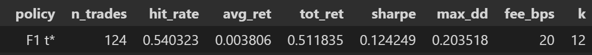

## Crypto LSTM Trader:

## What this is
End-to-end signal pipeline on BTC/USDT (1h): labels are k=12 bars ahead with an ε cutoff; features are rolling returns/ranges; train-only z-score; Pytorch LSTM model; threshold picked on validation by f1 and sharpe ratio, if sharpe ratio yields no trades then falls back to f1; evaluated on test with both classification metrics and a simple backtest. 

## Why this setup
- Train-only scaling and chronological splits to avoid leakage.
- Money threshold - f1 classification score isnt equal to money hence attempted implementation of sharpe ratio threshold score.
- Label sweep using a simple baseline model (scikit regression) to ensure we train the LSTM on a learnable label.
- Backtest is simple and explicit: long-only, hold k bars, fixed fees.

## Repo Layout 

preprocessing/
  fetch_binance.py         # ccxt fetch + CSV cache
  prep_data.py             # Preprocessing functions
datasets/
  sequence_dataset.py      # PyTorch dataset wrapper
models/
  lstm.py                  # LSTMClassifier, also stores best models
train/
  train_test_model.py      # fit, evaluate_test, predict_probs, threshold utils
backtest/
  backtest.py              # backtest_run + helpers 
reports/
  figs/                    # saved plots (created by the notebook)
Testing Notebook.ipynb  

## How to Use:
python -m pip install -r requirements.txt
Open the testing notebook and run all cells.

## Backtest Specification
- Entry: is when probabilty predicted > t*
- Position: long-only, hold for k-bars and force no overlap in trade signals
- Costs: fee_bps = 20 for a round trip
- Metrics: trades, hit rate, avg return, total equity return, Sharpe (per-trade), max drawdown.

## Results 

## Artifacts 

Generated by the notebook into reports/figs/:

- equity_f1_vs_money.png — equity curve comparison (TEST)

- drawdown_money.png — drawdown curve (TEST, money t*)

- hist_returns_money.png — histogram of per-trade returns (TEST, money t*)

## What I did (overview):

1. Label sweep on raw OHLCV to pick (k, ε) that a simple logistic can learn (by validation PR-AUC).

2. Build features, z-score on train only, and window the data (W=48).

3. Train LSTM (hidden=128, 2 layers) with class weighting, early stopping.

4. On validation, keep two thresholds:
    F1 t* for classification reporting.
    Attempted Money t* (Sharpe-max) for backtesting.

5. On test, report ROC/PR (threshold-free), confusion matrix at F1 t*, and backtest P&L (F1 t* and money t* if available).

## Limitations

- Single asset (BTC/USDT), single timeframe (1h), simple features.

- Long-only, no slippage/latency model; fee model is fixed bps.

- No online recalibration / walk-forward packaging in this version.

- Money threshold can be brittle on short validation windows (sometimes yields no trades).

# Possible Future Imporvements given More time
- Stabilise money threshold (larger val window, alternative grids, permit temporary overlap during selection only).

- Add walk-forward with expanding windows and fixed hyperparams.

- Try cross-asset features and regime tags.

- Compare to tree models (LightGBM on engineered features) and a temporal CNN.

- Add cost sensitivity table (10/20/50/100 bps) and save to CSV.